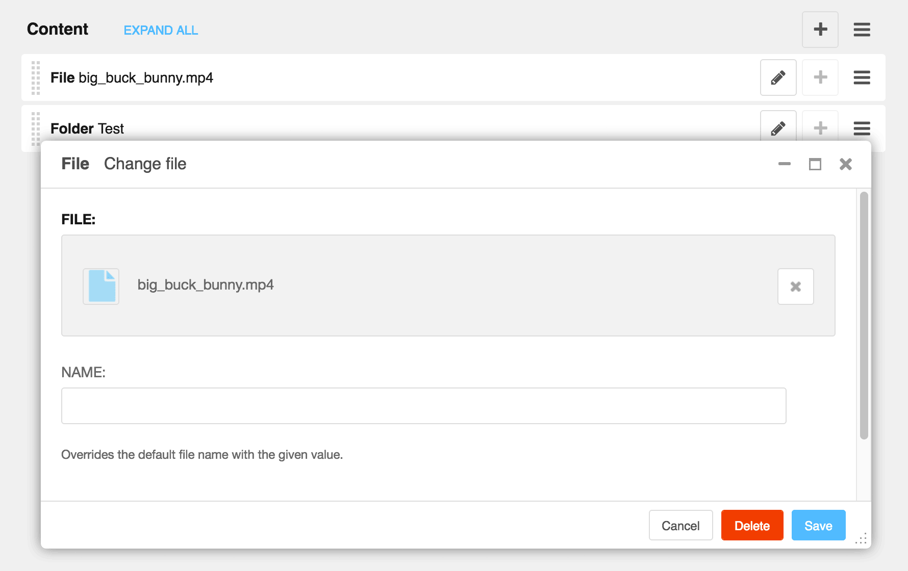

===============
django CMS File
===============

|pypi| |build| |coverage|

**django CMS File** is a set of plugins for `django CMS <http://django-cms.org>`_
that allow you to add files to your site You can either choose a single file or
an entire folder.

It uses files managed by `Django Filer <https://github.com/divio/django-filer>`_.

This addon is compatible with `Divio Cloud <http://divio.com>`_ and is also available on the
`django CMS Marketplace <https://marketplace.django-cms.org/en/addons/browse/djangocms-file/>`_
for easy installation.

Contributing
============

This is a an open-source project. We'll be delighted to receive your
feedback in the form of issues and pull requests. Before submitting your
pull request, please review our `contribution guidelines
<http://docs.django-cms.org/en/latest/contributing/index.html>`_.

We're grateful to all contributors who have helped create and maintain this package.
Contributors are listed at the `contributors <https://github.com/divio/djangocms-file/graphs/contributors>`_
section.

One of the easiest contributions you can make is helping to translate this addon on
`Transifex <https://www.transifex.com/projects/p/djangocms-file/>`_.

Documentation
=============

See ``REQUIREMENTS`` in the `setup.py <https://github.com/divio/djangocms-file/blob/master/setup.py>`_
file for additional dependencies:

|python| |django| |djangocms|

* Django Filer 1.2.4 or higher

Make sure `django Filer <http://django-filer.readthedocs.io/en/latest/installation.html>`_
is installed and configured appropriately.

Installation
------------

For a manual install:

* run ``pip install djangocms-file``
* add ``djangocms_file`` to your ``INSTALLED_APPS``
* run ``python manage.py migrate djangocms_file``

Configuration
-------------

Note that the provided templates are very minimal by design. You are encouraged
to adapt and override them to your project's requirements.

This addon provides a ``default`` template for all instances. You can provide
additional template choices by adding a ``DJANGOCMS_FILE_TEMPLATES``
setting::

    DJANGOCMS_FILE_TEMPLATES = [
        ('feature', _('Featured Version')),
    ]

You'll need to create the `feature` folder inside ``templates/djangocms_file/``
otherwise you will get a *template does not exist* error. You can do this by
copying the ``default`` folder inside that directory and renaming it to
``feature``.

Running Tests
-------------

You can run tests by executing::

    virtualenv env
    source env/bin/activate
    pip install -r test_requirements/base.txt
    python setup.py test

.. |pypi| image:: https://badge.fury.io/py/djangocms-file.svg
    :target: http://badge.fury.io/py/djangocms-file
.. |build| image:: https://travis-ci.org/divio/djangocms-file.svg?branch=master
    :target: https://travis-ci.org/divio/djangocms-file
.. |coverage| image:: https://codecov.io/gh/divio/djangocms-file/branch/master/graph/badge.svg
    :target: https://codecov.io/gh/divio/djangocms-file

.. |python| image:: https://img.shields.io/badge/python-2.7%20%7C%203.4+-blue.svg
    :target: https://pypi.org/project/djangocms-file/
.. |django| image:: https://img.shields.io/badge/django-1.11%20%7C%202.1%20%7C%202.2-blue.svg
    :target: https://www.djangoproject.com/
.. |djangocms| image:: https://img.shields.io/badge/django%20CMS-3.4%2B-blue.svg
    :target: https://www.django-cms.org/
